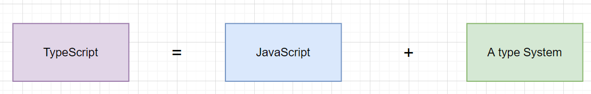

---
nav:
  title: 基础
  path: /base
group:
  title: 概述
  order: 1
---

# 概述

## 简介

TypeScript 是微软开发的自由和开源的编程语言。是 JavaScript 的一个超集，而且本质上给其添加了可选的静态类型和基于类的面向对象编程。



**类型系统的作用**

- 帮我们找寻编码时候的错误。
- 根据类型注释分析代码。
- 只在开发环境下生效
- 并不会带来性能上的优化。

## 安装使用

- 安装`typescript`

  ```shell
  npm install -g typescript
  ```

- 验证`typescript`

  ```shell
  tsc -v
  ```

- 编译`typescipt`

  ```shell
  tsc helloworld.ts
  ```

  当然，你可以前往[TypeScript Playground](https://www.typescriptlang.org/play)

## 工作流程


