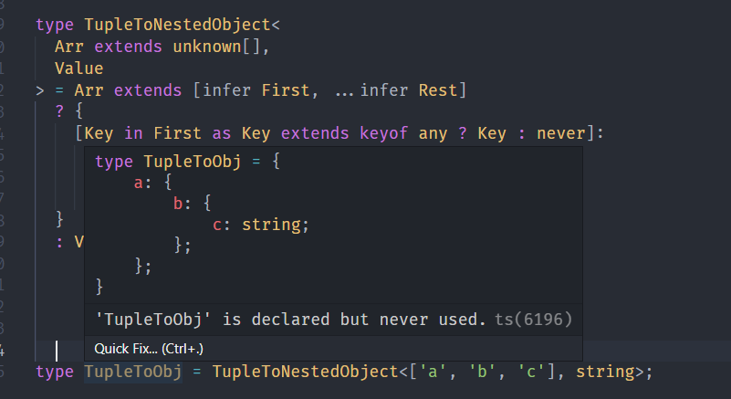

---
nav:
  title: 类型体操
  path: /type-programme
group:
  title: 实战案例
  order: 4
title: 类型编程综合实战一
order: 2
---

# 类型编程综合实战一

前面讲述的大多是针对某个套路的，我们来尝试一些综合案例。

## 案例

### KebabCaseToCamelCase

常见的变量规范有两种，一种是`KebabCase`,即`aaa-bbb-ccc`这种风格.另外一种是`CamelCase`，也就是`aaaBbbCcc`这样风格。

我们下面来实现这两个风格的转换。

从`hello-world`转成`helloWorld`

这里我们会使用[Capitalize](https://www.typescriptlang.org/docs/handbook/2/template-literal-types.html#capitalizestringtype)这个泛型工具，将首字母变成大写。

```ts
type KebabCaseToCamelCase<
  T extends string
> = T extends `${infer First}-${infer Rest}`
  ? `${First}${KebabCaseToCamelCase<Capitalize<Rest>>}`
  : T;

type KebabToCamelCase = KebabCaseToCamelCase<'hug-yyds'>;  // hugYyds
```

我们根据`extends`去推导去相对应的类型，即`First`和`Rest`的值，我们可以看到`First`每次只提取一个词，但`Rest`的话可能有多个词，所以得做遍历。


下面我们实现一下`CamelCaseToKebab`

### CamelCaseToKebabCase

这里由于没有分隔符，所以提取的时候比较复杂，得使用递归处理。

由于我们需要判断小写，同时要转换小写，所以，我们需要使用[Lowercase](https://www.typescriptlang.org/docs/handbook/2/template-literal-types.html#lowercasestringtype)

```ts
type CamelCaseToKebabCase<
  Str extends string
> = Str extends `${infer First}${infer Rest}`
  ? First extends Lowercase<First>
    ? `${First}${CamelCaseToKebabCase<Rest>}`
      : `-${Lowercase<First>}${CamelCaseToKebabCase<Rest>}`
        : Str;
```


### Chunk

希望实现这样的类型

比如`1,2,3,4,5`的数组，实现每两个元素为一组，就可以分成三个`chunk`.

```ts
type Chunk<
  Arr extends Array<any>,
  ItemLen extends number,
  CurItem extends unknown[] = [],
  Res extends unknown[] = []
> = Arr extends [infer First, ...(infer Rest)]
  ? CurItem['length'] extends ItemLen
    ? Chunk<Rest, ItemLen, [First], [...Res, CurItem]>
    : Chunk<Rest, ItemLen, [...CurItem, First], Res>
  : [...Res, CurItem];
```

效果


### TupleToNestedObject

我们希望实现一个功能

根据数组的类型，比如`['a', 'b', 'c']`的元组类型，再加上值的类型`xxx`，构造出这样的类型。

```ts
type TupleToNestedObject<
  Arr extends unknown[],
  Value
> = Arr extends [infer First, ...infer Rest]
  ? {
    [Key in First as Key extends keyof any ? Key : never]:
      Rest extends unknown[]
        ? TupleToNestedObject<Rest, Value>
        : Value
  }
  : Value;
```



### PartialObjectPropByKeys

有这么一个需求，我们把对象的某些字段置成可选的。

这个我们使用 TS 内置的工具即可。

```ts
type PartialObjectPropByKeys<
  T extends Record<string, any>,
  Key extends keyof T
> = Omit<T, Key> & Partial<Pick<T, Key>>;
```

效果


其他写法

```ts
type PartialObjectPropByKeys<
  T extends Record<string, any>,
  Key extends keyof T
> = {
  [Prop in Key]?: T[Key];
} &
  {
    [Prop in Exclude<keyof T, Key>]: T[Prop];
  };
```


## 总结

这节就各种类型的类型编程都做了一遍。

包括字符串类型、数组类型、索引类型的构造、提取，都涉及到了递归，也对内置的高级类型做了练习。

我们也可以突发奇想 去思考，我们还能做什么.

## 参考

- [TypeScript 类型体操通关秘籍](https://juejin.cn/book/7047524421182947366)
