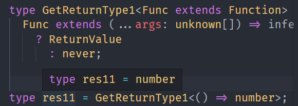
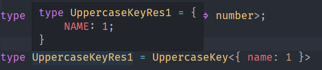
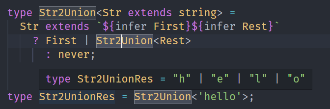
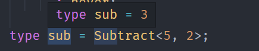
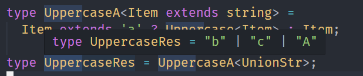
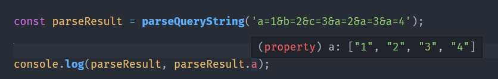

---
nav:
  title: 类型体操
  path: /type-programme
group:
  title: 模式
  order: 2
title: 类型体操总结
order: 7
---

# 类型体操总结

类型体操也是有套路的：

**模式匹配做提取，重新构造做变换**

**递归复用做循环，数组长度做计数**

**联合分散可简化，特殊特性要记清**

## 模式匹配做提取

就像正则提取字符串子串一样，`TS`的类型可以通过匹配一个模式类型来提取部分类型到`infer`声明的局部变量中去。

```ts
type GetReturnType<Func extends Function> = Func extends (
  ...args: unknown[]
) => infer ReturnValue
  ? ReturnValue
  : never;
```



## 重新构造做变换

TypeScript 类型系统可以通过 type 声明类型变量，通过 infer 声明局部变量，类型参数在类型编程中也相当于局部变量，但是它们都不能做修改，想要对类型做变换只能构造一个新的类型，在构造的过程中做过滤和转换。

在字符串、数组、函数、索引等类型都有很多应用，特别是索引类型。

比如把索引变为大写：

```ts
type UppercaseKey<Obj extends Record<string, any>> = {
  [Key in keyof Obj as Uppercase<Key as string>]: Obj[Key];
}
```



## 递归复用做循环

在 TypeScript 类型编程中，遇到数量不确定问题时，就要条件反射的想到递归，每次只处理一个类型，剩下的放到下次递归，直到满足结束条件，就处理完了所有的类型。

比如把长度不确定的字符串转为联合类型：

```ts
type Str2Union<Str extends string> =
  Str extends `${infer First}${infer Rest}`
    ? First | Str2Union<Rest>
      : never;
```



## 数组长度做计数

TypeScript 类型系统没有加减乘除运算符，但是可以构造不同的数组再取 length 来得到相应的结果。这样就把数值运算转为了数组类型的构造和提取。

```ts
type BuildArray<
    Length extends number,
    Ele = unknown,
    Arr extends unknown[] = []
> = Arr['length'] extends Length
        ? Arr
        : BuildArray<Length, Ele, [...Arr, Ele]>;

type Subtract<Num1 extends number, Num2 extends number> =
    BuildArray<Num1> extends [...arr1: BuildArray<Num2>, ...arr2: infer Rest]
        ? Rest['length']
        : never;
```



## 联合分散可简化

TypeScript 对联合类型做了特殊处理，当遇到字符串类型或者作为类型参数出现在条件类型左边的时候，会分散成单个的类型传入做计算，最后把计算结果合并为联合类型。

```ts
type UppercaseA<Item extends string> = Item extends 'a'
  ? Uppercase<Item>
  : Item;
```



## 特殊特性要记清

会了提取、构造、递归、数组长度计数、联合类型分散这 5 个套路以后，各种类型体操都能写，但是有一些特殊类型的判断需要根据它的特性来，所以要重点记一下这些特性。

比如 any 和任何类型的交叉都为 any，可以用来判断 any 类型：

## 练练手

### ParseQueryString

这个很类似我们在提取网址的 url 参数，但以前我们往往这样写。

```ts
function parseQueryString<T extends string>(str: T): Record<string, any> {
  if (!str) {
    return {} as any;
  }

  const queryMap: Record<string, any> = {};

  str.split('&').forEach(item => {
    const [key, value = ''] = item.split('=');
    if (key && value !== '') {
      if (queryMap[key]) {
        if (Array.isArray(queryMap[key])) {
          queryMap[key].push(value);
        } else {
          queryMap[key] = [queryMap[key], value];
        }
      } else {
        queryMap[key] = value;
      }
    }
  });

  return queryMap as any;
}
```

但上述的方案还是有点缺陷，因为他不能准确推断类型。

我们用类型改造一下。

```ts
type ParseParam<T extends string> =
  T extends `${infer Key}=${infer Value}`
    ? { [K in Key]: Value }
    : Record<string, any>;

type MergeValues<One, Other> =
  One extends Other
    ? One
      : Other extends unknown[]
        ? [One, ...Other]
          : [One, Other];


type MergeParam<
  OneParam extends Record<string, any>,
  OtherParam extends Record<string, any>
> = {
  [Key in keyof OneParam | keyof OtherParam]:
    Key extends keyof OneParam
      ? Key extends keyof OtherParam
        ? MergeValues<OneParam[Key], OtherParam[Key]>
          : OneParam[Key]
            : Key extends keyof OtherParam
              ? OtherParam[Key]
                : null;
}

type ParseQueryString<T extends string> =
  T extends `${infer Param}&${infer Rest}`
    ? MergeParam<ParseParam<Param>, ParseQueryString<Rest>>
      : ParseParam<T>;

function parseQueryString<T extends string>(str: T): ParseQueryString<T> {
  if (!str) {
    return {} as any;
  }

  const queryMap: Record<string, any> = {};

  str.split('&').forEach(item => {
    const [key, value = ''] = item.split('=');
    if (key && value !== '') {
      if (queryMap[key]) {
        if (Array.isArray(queryMap[key])) {
          queryMap[key].push(value);
        } else {
          queryMap[key] = [queryMap[key], value];
        }
      } else {
        queryMap[key] = value;
      }
    }
  });

  return queryMap as any;
}
```

效果



## 参考

- [TypeScript 类型体操通关秘籍 - zxg\_神说要有光 - 掘金小册 (juejin.cn)](https://juejin.cn/book/7047524421182947366)
