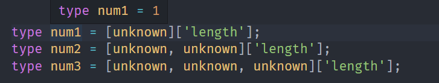
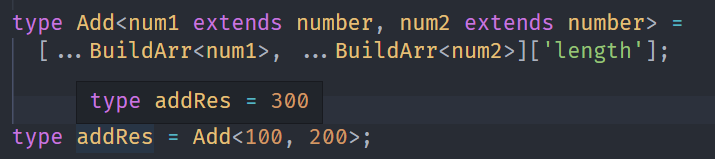
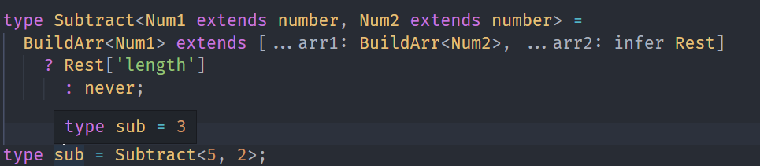
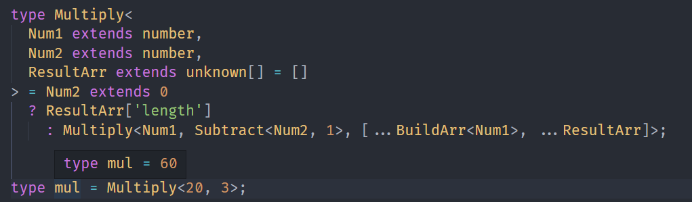
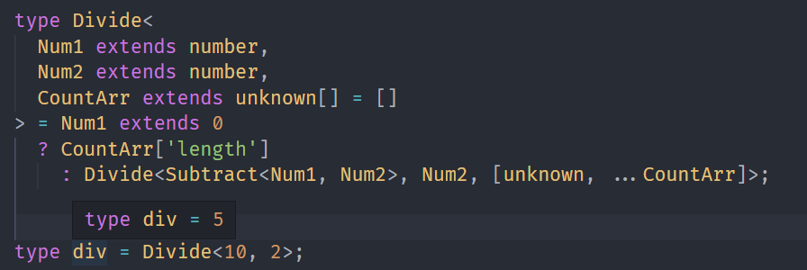
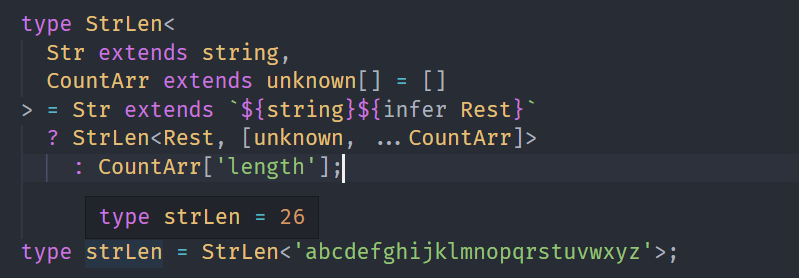
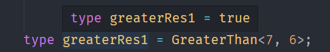
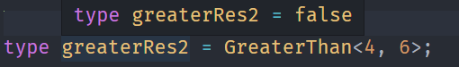
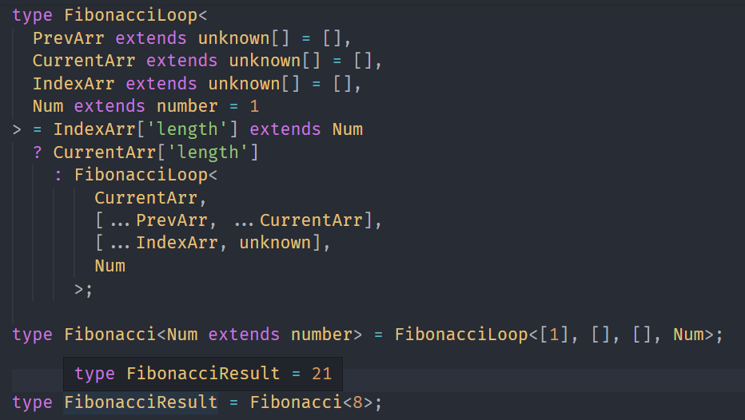

---
nav:
  title: 类型体操
  path: /type-programme
group:
  title: 模式
  order: 2
title: 数组计数
order: 4
---

# 数组长度做计数

在前面的学习中，我们已经实现`TypeScript`的一些类型编程，但好像没有发现数组计算的逻辑。

在这里的话，我们都是采用数组长度来做相关的计数。

## 数组长度做计数

`TypeScript`类型系统中没有加减乘除的运算符，怎么做数值运算。

但其实我们可以能过数组类型取`length`就是数值。

比如：



我们可以构造数组，然后取其中的`length`，来进行数值的运算。

**`TypeScript`类型系统中没有加减乘除运算符，但是可以通过构造不同的数组然后取`length`的方式来完成数值计算，把数值的加减乘除转化为对数组的提取和构造。**

## 数组长度实现加减乘除

### Add

我们知道得到数值的话，实际上应该先构造好数组，那我们可以想到

构造两个数组，然后合并，取`length`

上面我们实现过

```ts
type BuildArr<
  Length extends number,
  Ele = unknown,
  Arr extends unknown[] = []
> = Arr['length'] extends Length ? Arr : BuildArr<Length, Ele, [...Arr, Ele]>;
```

类型参数`Length`为构造的数组长度，`Ele`为数组元素，`Arr`为构造的数组。

所以我们的加法是构建两个数组，将其进行合并，并返回`length`.

```ts
type Add<num1 extends number, num2 extends number> = [
  ...BuildArr<num1>,
  ...BuildArr<num2>,
]['length'];
```



就这样，我们构造了一定长度的数组取`length`的方式实现了加法运算。

### Subtract

加法是构造数组，那么减法呢？在这里，我理解这种操作为解构。

比如 3 是[unknown, unknown, unknown]的数组类型，那么提取两个元素之后，剩下的数组再取`length`就是 1 了

```ts
type Subtract<Num1 extends number, Num2 extends number> =
  BuildArr<Num1> extends [...arr1: BuildArr<Num2>, ...arr2: infer Rest]
    ? Rest['length']
      : never;
```



这样子就实现了减法运算。

### Multiply

乘法的运算，我们试着将乘法分解为加法。

```ts
type Multiply<
  Num1 extends number,
  Num2 extends number,
  ResultArr extends unknown[] = []
> = Num2 extends 0
  ? ResultArr['length']
  : Multiply<Num1, Subtract<Num2, 1>, [...BuildArr<Num1>, ...ResultArr]>;
```



### Divide

下面我们来实现减法的运算

```ts
type Divide<
  Num1 extends number,
  Num2 extends number,
  CountArr extends unknown[] = []
> = Num1 extends 0
  ? CountArr['length']
  : Divide<Subtract<Num1, Num2>, Num2, [unknown, ...CountArr]>;
```



上方我们实现了加、减、乘、除，下面我们来做一些别的苏韩剧计算的类型体操。

## 数组长度实现计数

### StrLen

```ts
type StrLen<
  Str extends string,
  CountArr extends unknown[] = []
> = Str extends `${string}${infer Rest}`
  ? StrLen<Rest, [unknown, ...CountArr]>
    : CountArr['length'];
```



### GreaterThan

实现对比数值的大小关系。

```ts
type GreaterThan<
  Num1 extends number,
  Num2 extends number,
  CountArr extends unknown[] = []
> = Num1 extends Num2
  ? false
  : CountArr['length'] extends Num2
  ? true
  : CountArr['length'] extends Num1
  ? false
  : GreaterThan<Num1, Num2, [...CountArr, unknown]>;
```





### Fibonacci

```ts
type FibonacciLoop<
  PrevArr extends unknown[] = [],
  CurrentArr extends unknown[] = [],
  IndexArr extends unknown[] = [],
  Num extends number = 1
> = IndexArr['length'] extends Num
  ? CurrentArr['length']
  : FibonacciLoop<
      CurrentArr,
      [...PrevArr, ...CurrentArr],
      [...IndexArr, unknown],
      Num
    >;

type Fibonacci<Num extends number> = FibonacciLoop<[1], [], [], Num>;
```



## 总结

**`TypeScript`类型系统中没有加减乘除运算符，但是可以通过构造不同的数组然后取`length`的方式来完成数值计算，把数值的加减乘除转化为对数组的提取和构造。**
