---
nav:
  title: 类型体操
  path: /type-programme
group:
  title: 模式
  order: 2
title: 模式匹配
order: 1
---

# 模式匹配做提取

`TypeScript`类型编程的代码看起来比较复杂，其实这些逻辑我们在一些编程语言中用的比较熟悉了，只是我们对于`TypeScript`的编程不大习惯，所以我们的要熟悉套路。

首先，我们就来学习类型体操的第一个套路： 模式匹配做提取。

## 模式匹配

比如一个这样的`TypeScript`类型:

```ts
type p = Promise<'hug'>;
```

我们想提取`value`的类型，可以这么做

```ts
type GetPromiseValueType<P> = P extends Promise<infer Value> ? Value : never;
```

在这里，我们通过`extends`做模式匹配，同时用`infer`来提取局部变量`Value`保存。

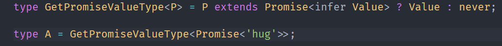

`TypeScript`得模式匹配：

> TypeScript 类型的模式匹配是通过`extends`对类型参数做匹配，结果通过`infer`声明的局部类型变量保存，匹配成功就能提出对应对应的类型。

我们来看看数组、字符串、函数中的应用。

## 数组类型

### First

数组类型中想提取第一个类型应该怎么做？

```ts
type arr = [1, 2, 3];
```

如下图所示

```ts
type GetFirst<Arr extends unknow[]> = Arr extends [infer First, ...unknown[]]
  ? First
  : never;
```

类型参数`Arr`通过`extends`约束只能是数组类型，数据元素是`unknown`可以是任何值。

我们对`Arr`做模式匹配，使用`infer`去推断第一个数据的类型，后面的使用`unknown`接收.

当类型参数为[1,2,3]

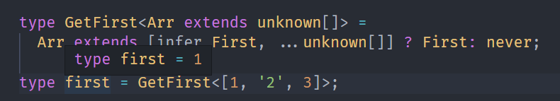

当类型参数 Arr 为[]时

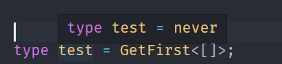

### Last

下面，我们实现提取最后一个元素。

```ts
type GetLast<Arr extends unknow[]> = Arr extends [...unknown[], infer Last]
  ? Last
  : never;
```

当我们的参数为[1, '2', 3]

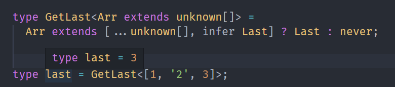

### PopArr

下面，我们提取剩余的数组元素。

```ts
type PopArr<Arr extends unknown[]> = Arr extends []
  ? []
  : Arr extends [...(infer Rest), unknown]
  ? Rest
  : never;
```

当我们的参数为`[1,2,3]`

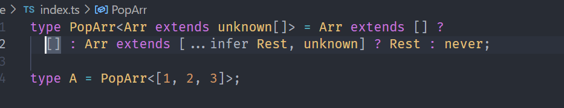

### ShiftArr

下面，我们实现`ShiftArr`

```ts
type ShiftArr<Arr extends unknown[]> = Arr extends []
  ? []
  : Arr extends [unknown, ...(infer Rest)]
  ? Rest
  : never;
```

当我们的参数为`[1,2,3]`

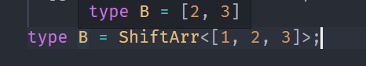

## 字符串类型

字符串类型也可以做模式匹配，匹配一个模式字符串，将变量通过`infer`提取。

### StartsWith

判断字符串是否以某个前缀开头，也是通过模式匹配。

```ts
type StartsWith<Str extends string, Prefix extends string> = Prefix extends '' ?
  false :
  Str extends `${Prefix}${string}` ? true : false;
```

**匹配时**

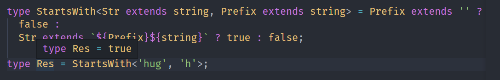

**不匹配时：**

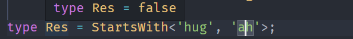

### Replace

字符串可以匹配一个模式类型，提取想要的部分，然后加以替换

```ts
type ReplaceStr<
  Str extends string,
  From extends string,
  To extends string
> = Str extends `${infer Prefix}${From}${infer Suffix}`
  ? `${Prefix}${To}${Suffix}`
  : Str;
```

例子：

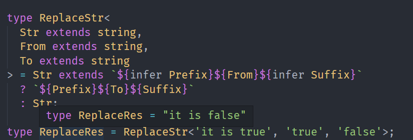

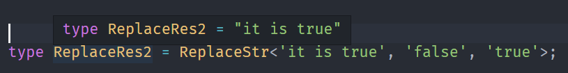

### Trim

我们先实现`TrimRight`

```ts
type TrimStr = ' ' | '\n' | '\t';

type TrimRight<Str extends string> = Str extends `${infer Rest}${TrimStr}`
  ? TrimRight<Rest>
  : Str;
```

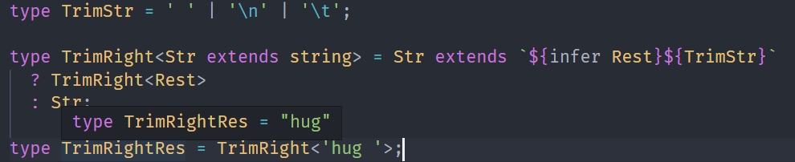

接着，我们实现`TrimLeft`

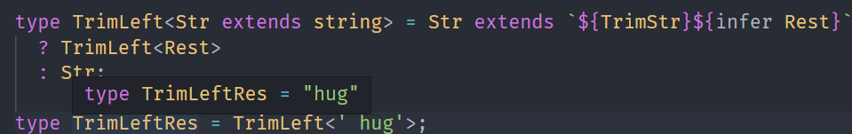

最后，我们基于`TrimLeft`和`TrimRight`实现`Trim`

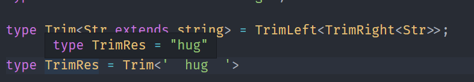

## 函数

函数同样可以做类型匹配，比如提取参数、返回值的类型。

### GetParameters

函数类型可以通过模式匹来提取参数的类型。

```ts
type GetParameters<Func extends Function> = Func extends (
  ...args: infer Parameters
) => any
  ? Parameters
  : never;
```

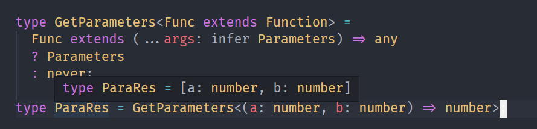

### GetReturnType

提取参数类型，同时可以提取返回值类型。

```ts
type GetReturnType<Func extends Function> = Func extends (
  ...args: unknown[]
) => infer Res
  ? Res
  : never;
```

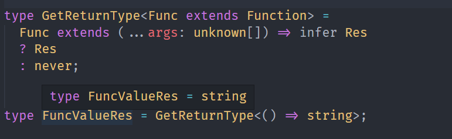

## 总结

模式匹配可以提取类型中的某一部分，抽出子组。

注意`extends`和`infer`的相互使用。
