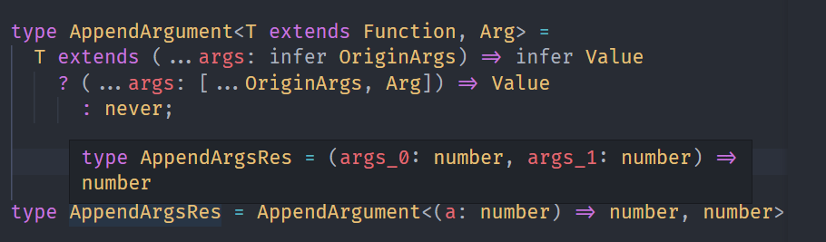
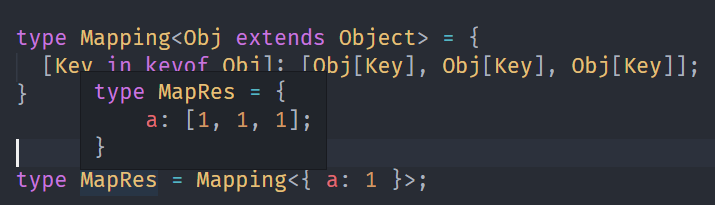
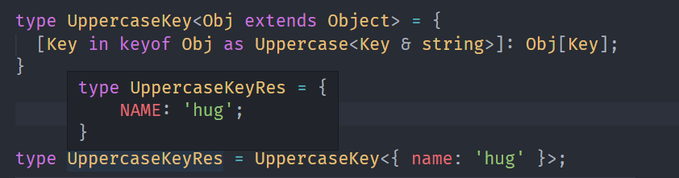
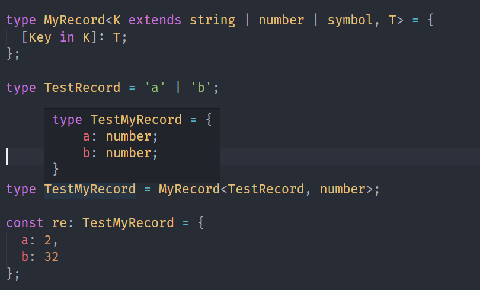
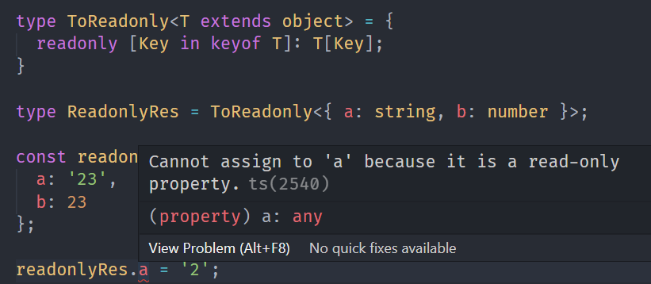
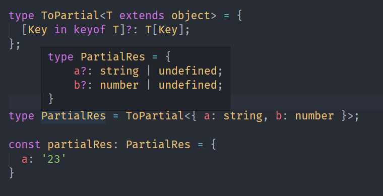
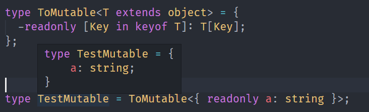
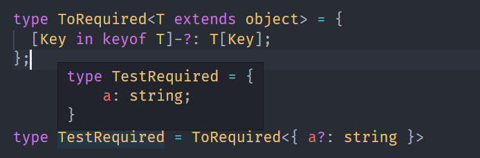
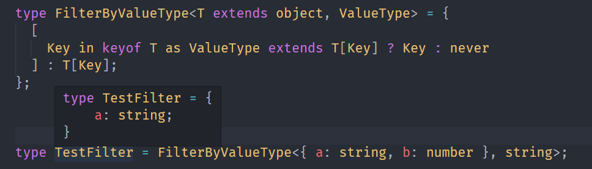

---
nav:
  title: 类型体操
  path: /type-programme
group:
  title: 模式
  order: 2
title: 重新构造
order: 2
---

# 重新构造

## 概述

类型编程主要的目的就是对类型做各种转换，那么如何对类型进行修改呢。

`TypeScript`类型系统支持 3 种可以声明任意类型的变量: `type`,`infer`,`类型参数`。

`type`做类型别名，其实就是声明一个变量存储某种类型。

```ts
type ttt = Promise<number>;
```

`infer`用于类型的提取，然后存到一个变量里，相当于局部变量。

这里的`Value`是局部变量。

```ts
type GetValueType<P> = P extends Promise<infer Value> ? Value : never;
```

类型参数用于接收具体的类型，在类型运算中相当于局部变量。

```ts
type isTwo<T> = T extends 2 ? true : false;
```

但是以上的“变量”实际上都不能被重新赋值。

`TypeScript`可以进行类型编程从而产生各种复杂的类型，那不能修改如何产生新类型？`重新构造`

**`TypeScript`的`type`、`infer`，类型参数声明的变量都不能修改，对类型做各种变换产生新的类型需要重新构造。**

## 数组类型的重新构造

### Push

我们希望给一个元组类型，添加一些类型，应该怎么做呢。

```ts
type Push<Arr extends unknown[], Ele> = [...Arr, Ele];
```


### Unshift

同时，我们可以在前面做添加。

```ts
type Unshift<Arr extends unknow[], Ele> =
```


### Zip

有这么两个元组

```ts
type tuple1 = [1, 2];
type tuple2 = ['guang', 'dong'];
```

我们想把它合并成这样的元组

```ts
type tuple = [[1, 'guang'], [2, 'dong']];
```

我们只需要提取元组的两个元素，构成新的元组就行了

```ts
type Zip<One extends unknown[], Other extends unknown[]> = One extends [
  infer OneFirst,
  ...(infer OneRest),
]
  ? Other extends [infer OtherFirst, ...(infer OtherRest)]
    ? [[OneFirst, OtherFirst], ...Zip<OneRest, OtherRest>]
    : []
  : [];
```

## 字符串类型的重新构造

**从已有的字符串类型中提取出一些部分字符串，经过一系列变换，构成新的字符串类型。**

### CapitalizeStr

我们实现一个字符串字面量类型转成首字符大写，需要用到字符串类型的提取和重新构造。

```ts
type CapitalizeStr<Str extends string> =
  Str extends `${infer First}${infer Rest}`
    ? `${Uppercase<First>}${Rest}`
      : never;
```


### CamelCase

我们再来实现下划线转驼峰的变换。`dong_dong_dong` -> `dongDongDong`的变换。

同样是提取和构造。

```ts
type CamelCase<Str extends string> =
  Str extends `${infer Left}_${infer Right}${infer Rest}`
    ? `${Left}${Uppercase<Right>}${CamelCase<Rest>}`
      : Str;
```


### DropSubStr

我们来实现一下删除：删除字符串中的某个子串。

```ts
type DropSubStr<Str extends string, SubStr extends string> =
  Str extends `${infer Prefix}${SubStr}${infer Suffix}`
    ? DropSubStr<`${Prefix}${Suffix}`, SubStr>
      : Str;
```


## 函数类型

### AppendArgument

下面我们实现在原有的函数类型上添加一个参数。

```ts
type AppendArgument<T extends Function, Arg> = T extends (
  ...args: infer OriginArgs
) => infer Value
  ? (...args: [...OriginArgs, Arg]) => Value
  : never;
```



## 索引类型

### Mapping

```ts
type Mapping<Obj extends Object> = {
  [Key in keyof Obj]: [Obj[Key], Obj[Key], Obj[Key]];
};
```



### UppercaseKey

下面实现将索引转大写

```ts
type UppercaseKey<Obj extends Object> = {
  [Key in keyof Obj as Uppercase<Key & string>]: Obj[Key];
}
```



### Record

TypeScript 提供内置的高级类型`Record`来创建索引类型。

```ts
type Record<K extends string | number | symbol, T> = {
  [P in K]: T;
};
```



### ToReadonly

我们都知道索引类型可以添加 readonly 的修饰符，代表只读。

那我们可以结果索引类型添加`readonly`修饰的高级类型。

```ts
type ToReadonly<T extends object> = {
  readonly [Key in keyof T]: T[Key];
};
```



### ToPartial

索引类型可以添加可选修饰符

```ts
type ToPartial<T extends object> = {
  [Key in keyof T]?: T[Key];
};
```



### ToMutable

可以添加`readonly`修改，也可以去掉

```ts
type ToMutable<T extends object> = {
  -readonly [Key in keyof T]: T[Key];
};
```



### ToRequired

同理，我们可以去掉可选修饰符

```ts
type ToRequired<T extends object> = {
  [Key in keyof T]-?: T[Key];
};
```



### FilterByValueType

我们可以结果索引类型保留我们想要过滤的类型。

```ts
type FilterByValueType<T extends object, ValueType> = {
  [
    Key in keyof T as ValueType extends T[Key] ? Key : never
  ] : T[Key];
};
```



## 总结

`TypeScript`类型系统支持 3 种可以声明任意类型的变量: `type`,`infer`,`类型参数`。

**`TypeScript`的`type`、`infer`，类型参数声明的变量都不能修改，对类型做各种变换产生新的类型需要重新构造。**
