---
nav:
  title: 类型体操
  path: /type-programme
group:
  title: 模式
  order: 2
title: 递归复用
order: 3
---

# 递归复用

会做类型的提取和构造之后，我们已经能进行一定程度的类型编程，但有时候因为提供或构造的数组元素个数不确定、字符串长度不确定、对象层数不去欸的那个。该怎么办呢？`递归`

第三个类型体操套路：**递归复用做循环**

## 递归复用

**`TypeScript`不支持循环，但支持递归。当处理数量(个数、长度、层数)不固定类型的时候，可以只处理一个类型，然后递归的调用自身处理下一个类型，直到条件接收，完成不确定数量的类型编程，达到循环的效果。**

## Promise 的递归复用

### DeepPromiseValueType

先用 Promise 热身，实现一个提取不确定层数`Promise`中的`Value`类型的高级类型。

```ts
type ttt = Promise<Promise<Promise<Record<string, any>>>>;
```

这是三层`Promise`,`Value` 类型是索引类型。

我们使用最简单的方式提取。

```ts
type GetThirdLayerPromiseValue<T> = T extends Promise<
  Promise<Promise<infer Value>>
>
  ? Value
  : never;
```

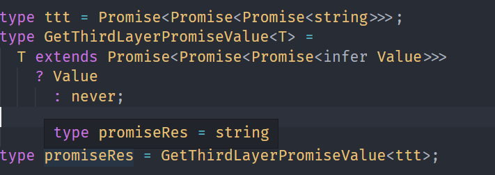

当时这个过于局限，所以，我们来试着用递归的写法。

```ts
type DeepPromiseValueType<P extends Promise<any>> = P extends Promise<
  infer Value
>
  ? Value extends Promise<any>
    ? DeepPromiseValueType<Value>
    : Value
  : never;
```

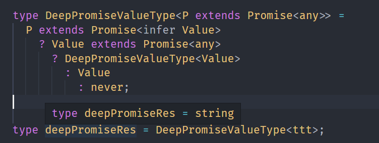

## 数组类型的递归

### ReverseArr

我们尝试将元组进行倒转。

即`[1, 2, 3, 4, 5]`->`[5, 4, 3, 2, 1]`

我们学习了提取和构造其实很容易。

```ts
type ReverseTempArr<Arr extends unknown[]> = Arr extends [
  infer One,
  infer Two,
  infer Three,
  infer Four,
  infer Five,
]
  ? [Five, Four, Three, Two, One]
  : never;
```

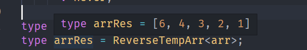

但这样的，可复用性太低了。

我们修改一下

```ts
type ReverseArr<Arr extends unknown[]> = Arr extends [
  infer First,
  ...(infer Rest),
]
  ? [...ReverseArr<Rest>, First]
  : Arr;
```

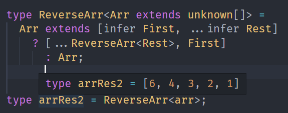

### Include

```ts
type Includes<Arr extends unknown[], Item> = Arr extends [
  infer First,
  ...(infer Rest),
]
  ? isEqual<First, Item> extends true
    ? true
    : Includes<Rest, Item>
  : false;
```

**当包含时：**

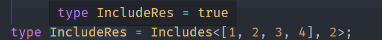

**当不包含时：**

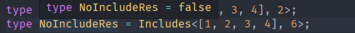

### RemoveItem

```ts
type RemoveItem<
  Arr extends unknown[],
  Item,
  Result extends unknown[] = []
> = Arr extends [infer First, ...(infer Rest)]
  ? isEqual<First, Item> extends true
    ? RemoveItem<Rest, Item, Result>
    : RemoveItem<Rest, Item, [...Result, First]>
  : Result;
```

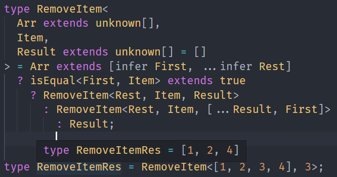

### BuildArray

```ts
type BuildArray<
  Length extends number,
  Ele = unknown,
  Arr extends unknown[] = []
> = Arr['length'] extends Length ? Arr : BuildArray<Length, Ele, [...Arr, Ele]>;
```

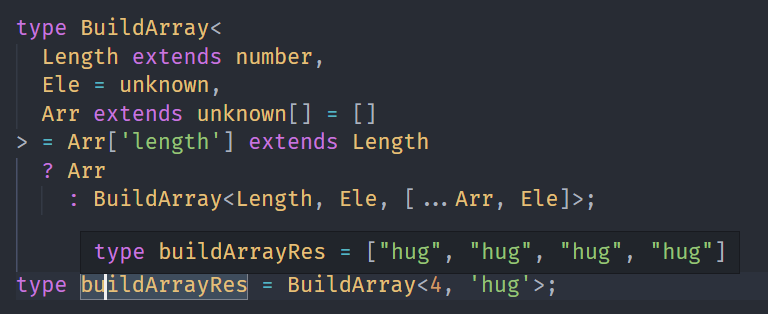

## 字符串类型的递归

### ReplcaeAll

之前我们实现了`Replace`，下面我们实现`ReplaceAll`。

```ts
type ReplaceAll<
  Str extends string,
  From extends string,
  To extends string
> = Str extends `${infer Left}${From}${infer Right}`
  ? `${Left}${To}${ReplaceAll<Right, From, To>}`
    : Str;
```

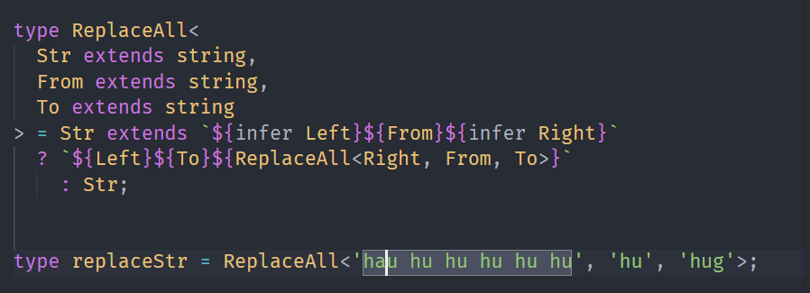

### StringToUnion

我们想通过字符串字面量类型的每个字符都提起成联合类型，就是把`hug`->`h`、`u`、`g`;

很明显也是提取和构造

```ts
type StringToUnion<Str extends string> =
  Str extends `${infer First}${infer Rest}`
    ? First | StringToUnion<Rest>
      : never;
```

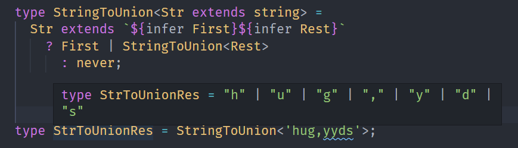

### ReverseStr

我们也可以实现字符串类型的反转

```ts
type ReverseStr<
  Str extends string,
  Result extends string = ''
> = Str extends `${infer First}${infer Rest}`
  ? ReverseStr<Rest, `${First}${Result}`>
    : Result;
```

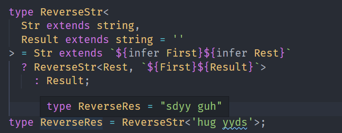
