---
nav:
  title: 类型体操
  path: /type-programme
group:
  title: 模式
  order: 2
title: 特殊特性
order: 6
---

# 特殊特性要记清

有些类型的特性需要专门记录。

## 特殊类型的特性

TypeScript 类型系统中有些类型比较特殊，比如 any、never、联合类型，比如 class 有 public、protected、private 的属性，比如索引类型有具体的索引和可索引签名，索引还有可选和非可选。。。

如果给我们一种类型让我们判断是什么类型，应该怎么做呢？

**类型的判断要根据它的特性来，比如判断联合类型就要根据它的 distributive 的特性。**

我们分别看一下这些特性：

我们分别看一下这些特性：

## IsAny

如何判断一个类型是`any`的类型？要根据特性来：

**any 类型与任何类型的交叉都是 any,也就是 1&any 结果是 any**

于是，我们可以这么写

```ts
type IsAny<T> = 1 extends 0 & T ? true : false;
```

当传入 any 时

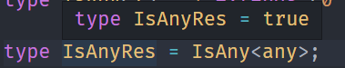

当传入非 any 时

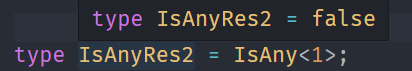

## IsUnion

上次我们写过了`Union`类型

```ts
type IsUnion<A, B = A> = A extends A ? ([B] extends [A] ? false : true) : never;
```

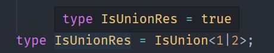

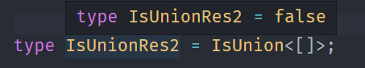

## IsNever

```ts
type IsNever<T> = [T] extends [never] ? true : false;
```

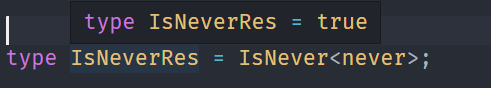

除此以外，any 在条件类型中也比较特殊，如果类型参数为 any，会直接返回 trueType 和 falseType 的合并：

```typescript
type TestAny<T> = T extends number ? 1 : 2;
```

## IsTuple

元组类型怎么判断呢？它和数组有什么区别呢？

**元组类型也是数组类型，但每个元素都是只读的，并且 length 是数字字面量，而数组的 length 是 number。**

第一个特性，元组类型也是数组类型，并且每个元素都是只读，这个很好理解。

我们重点来看第二个特性：

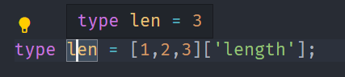

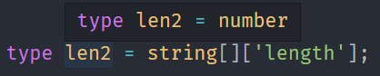

如图，元组和数组的 length 属性值是有区别的。

那我们就可以根据这两个特性来判断元组类型：

```ts
type IsTuple<T> = T extends readonly [...(infer Eles)]
  ? NotEqual<Eles['length'], number>
  : false;
```

类型参数 T 是要判断的类型。

首先判断 T 是否是数组类型，如果不是则返回 false。如果是继续判断 length 属性是否是 number。

如果是数组并且 length 不是 number 类型，那就代表 T 是元组。

NotEqual 的实现是这样的：

```ts
type NotEqual<A, B> = (<T>() => T extends A ? 1 : 2) extends <
  T
>() => T extends B ? 1 : 2
  ? false
  : true;
```

A 是 B 类型，并且 B 也是 A 类型，那么就是同一个类型，返回 false，否则返回 true。

这样就可以判断出元组类型：

当传入元组时：

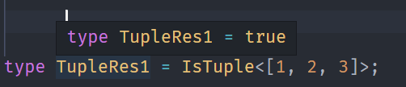

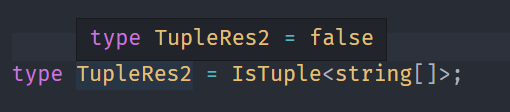

## UnionToIntersection

类型之间是有大小关系的，比如 A 和 B 的交叉类型 A & B 就比联合类型 A | B 小。

如果从大的类型变为小的类型，那就是类型的缩小，叫做**逆变**。

如果从小的类型变为大的类型，那就是类型的放大，叫做**协变**。

如果大小没变化，叫做**不变**。

在 TypeScript 中有函数参数是有逆变的性质的，也就是如果传入联合类型，会返回交叉类型。

所以联合转交叉可以这样实现 ：

```ts
type UnionToIntersection<U> = (U extends U
? (x: U) => unknown
: never) extends (x: infer R) => unknown
  ? R
  : never;
```

类型参数 U 是要转换的联合类型。

U extends U 是为了触发联合类型的 distributive 的性质，让每个类型单独传入做计算，最后合并。

利用 U 做为参数构造个函数，通过模式匹配取参数的类型。

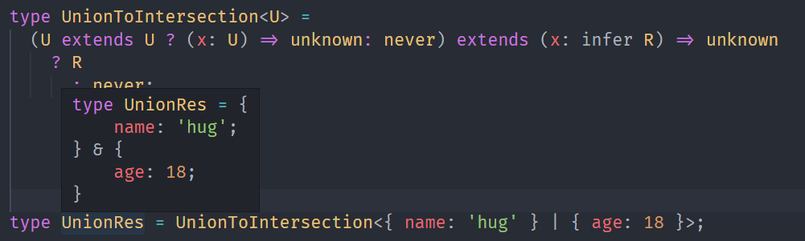

## GetOptional

如何提取索引类型中的可选索引呢？

这也要利用可选索引的特性：**可选索引的值为 undefined 和值类型的联合类型**。

```ts
type GetOptional<Obj extends Record<string, any>> = {
  [
    Key in keyof Obj as
      {} extends Pick<Obj, Key> ? Key : never
  ]: Obj[Key];
}
```

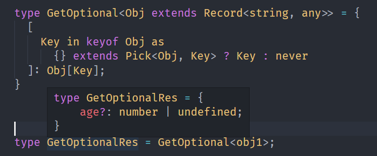

## GetRequired

```ts
type GetRequired<Obj extends Record<string, any>> = {
  [
    Key in keyof Obj as
      {} extends Pick<Obj, Key> ? never : Key
  ]: Obj[Key];
}
```

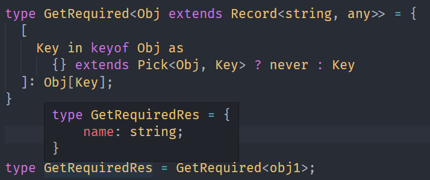

## RemoveIndexSignature

```ts
type Dong = {
  [key: string]: any;
  sleep(): void;
};
```

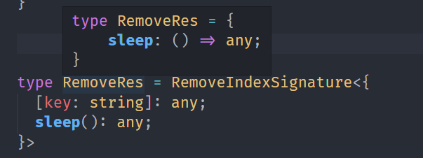

## ClassPublicProps

```ts
type ClassPublicProps<Obj extends Record<string, any>> = {
  [Key in keyof Obj]: Obj[key];
};
```

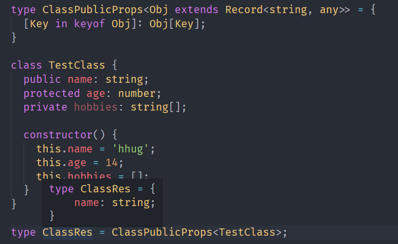

## 总结

- any 类型与任何类型的交叉都是 any，也就是 1 & any 结果是 any，可以用这个特性判断 any 类型。
- 联合类型作为类型参数出现在条件类型左侧时，会分散成单个类型传入，最后合并。
- never 作为类型参数出现在条件类型左侧时，会直接返回 never。
- any 作为类型参数出现在条件类型左侧时，会直接返回 trueType 和 falseType 的联合类型。
- 元组类型也是数组类型，但每个元素都是只读的，并且 length 是数字字面量，而数组的 length 是 number。可以用来判断元组类型。
- 函数参数处会发生逆变，也就是类型缩小，可以用来实现联合类型转交叉类型。
- 可选索引的值为 undefined 和值类型的联合类型。可以用来过滤可选索引，反过来也可以过滤非可选索引。
- 索引类型的索引一般为 string 类型，而可索引签名不是，可以用这个特性过滤掉可索引签名。
- keyof 只能拿到 class 的 public 的索引，可以用来过滤出 public 的属性。
