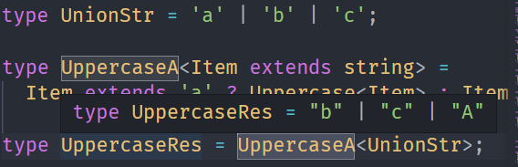
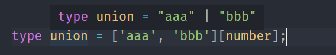

---
nav:
  title: 类型体操
  path: /type-programme
group:
  title: 模式
  order: 2
title: 联合分散
order: 5
---

# 联合分散可简化

联合类型在类型编程中是比较特殊的，`TypeScript`对他进行了专门的处理，写法可以简化。

这是类型体操的第五个讨论：联合分散可简化。

## 分布式条件类型

**当类型参数为联合类型，并且在条件类型左边直接引用该类型参数的时候，`TypeScript`会将每一个元素单独传入来做类型运算，最后再合并成联合类型，这种语法叫分布式条件类型。**

比如这样的联合类型

```ts
type Union = 'a' | 'b' | 'c';
```

我们只想把 a 大写，就可以

```ts
type UppercaseA<Item extends string> = Item extends 'a'
  ? Uppercase<Item>
  : Item;
```



可以看到，我们类型参数 Item 约束为 string，条件类型的判断中也是判断是否是 a，但传入的是联合类型。

这就是 TypeScript 对联合类型在条件类型中使用时的特殊处理：会把联合类型的每一个元素单独传入做类型计算，最后合并。

这和联合类型遇到字符串时的处理一样：

```ts
type str = `${Union}~~`;
```


这样简化了类型编程的逻辑，不需要递归提取每个元素。

TypeScript 之所以这样处理联合类型也很容易理解，因为联合类型的每个元素都是互不相关的，不像数组、索引、字符串那样元素之间是有关系的。所以设计成了每一个单独处理，最后合并。

## CamelcaseUnion

Camelcase 我们实现过，就是提取字符串中的字符，首字母大写以后重新构造一个新的。

```ts
type Camelcase<Str extends string> =
    Str extends `${infer Left}_${infer Right}${infer Rest}`
    ? `${Left}${Uppercase<Right>}${Camelcase<Rest>}`
    : Str;
```

提取 \_ 左右的字符，把右边字符大写之后构造成新的字符串，余下的字符串递归处理。

如果是对字符串数组做 Camelcase，那就要递归处理每一个元素：

```ts
type CamelCaseArr<
  Arr extends unknown[],
  Result extends unknown[] = []
> = Arr extends [infer First, ...(infer Rest)]
  ? [...Result, CamelCase<First & string>, ...CamelCaseArr<Rest>]
  : Result;
```


如果是联合类型呢？

联合类型不需要提取每个元素，`Typescript`会把每一个元素传入单独计算，之后每个元素的计算结果合并。

```ts
type CamelCaseUnion<Item extends string> =
  Item extends `${infer First}_${infer Right}${infer Rest}`
    ? `${First}${Uppercase<Right>}${CamelCaseUnion<Rest>}`
      : Item;
```


没错，对联合类型的处理和对单个类型的处理没什么区别，TypeScript 会把每个单独的类型拆开传入。不需要像数组类型那样需要递归提取每个元素做处理。

确实简化了很多，好像都是优点？

不过下面的例子，可能不是特别好接受。

## IsUnion

判断联合类型我们会这样写

```ts
type isUnion<A, B = A> = A extends A ? ([B] extends [A] ? false : true) : never;
```

当传入联合类型，返回 true


我们会发现上面的类型很奇怪。

那我们先来看看这样的一个类型。

```ts
type TestUnion<A, B = A> = A extends A ? { a: A; b: B } : never;

type TestUnionRes = TestUnion<'a' | 'b' | 'c'>;
```

当传入联合类型时，结果时这样的


A 和 B 都是同一个联合类型，为啥值还不一样呢？

因为条件类型中如果左边的类型是联合类型，会把每个元素单独传入做计算，而右边不会。

所以 A 是 'a' 的时候，B 是 'a' | 'b' | 'c'， A 是 'b' 的时候，B 是 'a' | 'b' | 'c'。。。

那么利用这个特点就可以实现`Union`类型的判断

```ts
type IsUnion<A, B = A> = A extends A ? ([B] extends [A] ? false : true) : never;
```

类型参数 A、B 是待判断的联合类型，B 默认值为 A，也就是同一个类型。

A extends A 这段看似没啥意义，主要是为了触发分布式条件类型，让 A 的每个类型单独传入。

[B] extends [A] 这样不直接写 B 就可以避免触发分布式条件类型，那么 B 就是整个联合类型。

B 是联合类型整体，而 A 是单个类型，自然不成立，而其它类型没有这种特殊处理，A 和 B 都是同一个，怎么判断都成立。

利用这个特点就可以判断出是否是联合类型。

其中有两个点比较困惑，我们重点记一下：

**当 A 是联合类型时：**

- **A extends A 这种写法是为了触发分布式条件类型，让每个类型单独传入处理的，没别的意义。**
- **A extends A 和 [A] extends [A] 是不同的处理，前者是单个类型和整个类型做判断，后者两边都是整个联合类型，因为只有 extends 左边直接是类型参数才会触发分布式条件类型。**

理解了这两点，分布式条件类型就算掌握了。

## BEM

bem 是 css 命名规范，用 block\_\_element--modifier 的形式来描述某个区块下面的某个元素的某个状态的样式。

那么我们可以写这样一个高级类型，传入 block、element、modifier，返回构造出的 class 名：

这样使用：

```typescript
type bemResult = BEM<'guang', ['aaa', 'bbb'], ['warning', 'success']>;
```

它的实现就是三部分的合并，但传入的是数组，要递归遍历取出每一个元素来和其他部分组合，这样太麻烦了。

数组转联合类型可以这么写



```ts
type BEM<
  Block extends string,
  Element extends string[],
  Modifiers extends string[]
> = `${Block}__${Element[number]}--${Modifiers[number]}`;
```


## AllCombinations

我们再来实现一个全组合的高级类型，也是联合类型相关的：

希望传入 'A' | 'B' 的时候，能够返回所有的组合： 'A' | 'B' | 'BA' | 'AB'。

这种全组合问题的实现思路就是两两组合，组合出的字符串再和其他字符串两两组和：

比如 'A' | 'B' | 'c'，就是 A 和 B、C 组合，B 和 A、C 组合，C 和 A、B 组合。然后组合出来的字符串再和其他字符串组合。

任何两个类型的组合有四种：A、B、AB、BA

我们先考虑两个两个的情况

```ts
type Combination<A extends string, B extends string> =
  A | B | `${A}${B}` | `${B}${A}`;
```

我们可以理解`AllCombinations`就是对联合类型中每一个类型进行提取，在和其他的类型进行`Combination`运算，并且合并的结果。

```ts
type AllCombinations<A extends string, B = A> = A extends A
  ? Combination<A, AllCombinations<Exclude<B & string, A>>>
  : never;
```


## 总结

**联合类型中的每个类型都是相互独立的，TypeScript 对它做了特殊处理，也就是遇到字符串类型、条件类型的时候会把每个类型单独传入做计算，最后把每个类型的计算结果合并成联合类型。**

条件类型左边是联合类型的时候就会触法这种处理，叫做分布式条件类型。

有两点特别要注意：

- A extends A 不是没意义，意义是取出联合类型中的单个类型放入 A
- A extends A 才是分布式条件类型， [A] extends [A] 就不是了，只有左边是单独的类型参数才可以。
