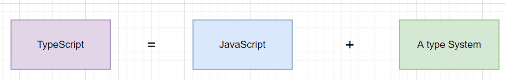

---
nav:
  title: 类型体操
  path: /type-programme
group:
  title: 概述
  order: 1
title: TypeScript概述
order: 1
---

# 概述

`TypeScript` 以越来越成为主流了，如今的前端工程开发，以及各类框架，多数都基于`TypeScript`去进行实现。

学习过`TypeScript`的同学，应该都知道`TypeScript`与`JavaScript`的关系。

实质上，如下图所示

> TypeScript 是 JavaScript 的一个超集，而且本质上给其添加了可选的静态类型和基于类的面向对象编程。

那么问题来了，为什么`TypeScript`越来越主流了呢？

个人理解，使得`TypeScript`越来越流行的原因正是`类型系统`。

## 什么是类型

**那我们思考一下：类型是什么？**

类型具体就是编程语言中的`基础类型`和`复合类型`，是编程语言对与不同的数据内容的一种抽象描述。

- 不同的类型变量占据的内存大小不同
- 不同的类型变量可做的操作不同。

`类型检查`是为了保证我们的类型要和所作的操作相匹配。

如果能保证某种类型只做该类型允许的操作，这就叫做`类型安全`。

`类型检查`是为了保证`类型安全`的。

类型检查可以运行时候做，也可以在编译的时候做。前者为`动态类型检查`，后者为`静态类型检查`。

### 两种类型的优缺点

- **动态类型**：操作灵活，可以当成任意的对象，变量的存放的内容类型可以多变。但也埋下了类型不安全的隐患。
- **静态类型**：静态类型语言的话，变量有严格的类型限制，编译过程中会进行类型检查。但增加了变量类型的开发成本。

就上述的对比来说，静态语言开发虽然增加了开发成本，但减少了项目的隐患，适用于大型项目。

`TypeScript`给`JavaScript`添加了一套静态类型系统，从`动态类型语言`变成了`静态类型语言`,在编译期间进行相关的类型检查，提前暴露类型安全问题。

同时，我们的配合我们的编译器，也能实现更好的提示等。

## 总结

类型是编程语言对不同数据内容的抽象描述。决定了变量的大小以及变量的操作。

类型检查分为`动态类型检查`和`静态类型检查`。

`JavaScript`是一个动态类型语言，随着前端的这几年需求的增大，也有了对静态类型的要求。`TypeScript`满足了相关的需求。

## 参考

- [ TypeScript 类型体操通关秘籍](https://juejin.cn/book/7047524421182947366/section)
