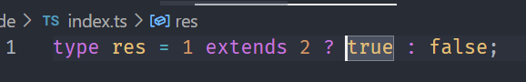
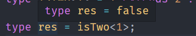
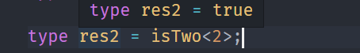
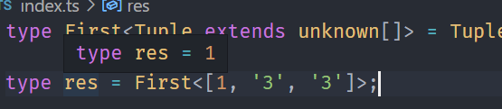
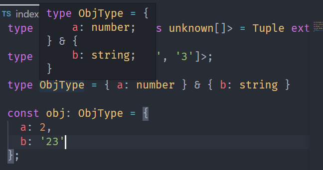
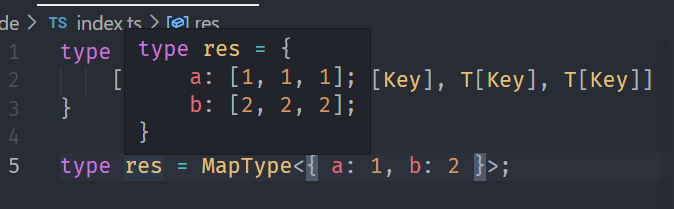
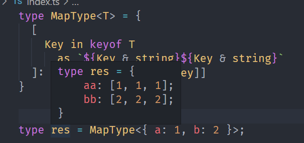

---
nav:
  title: 类型体操
  path: /type-programme
group:
  title: 概述
  order: 1
title: 类型运算
order: 3
---

# 类型运算

`TypeScript`能对类型进行编程，那么类型系统支持什么运算呢？

## Typescript 类型运算

### 条件: extends ?:

`TypeScript`里的条件判断是`extends ? :` 这种写法类似三目运算符，叫做条件类型(Conditional Type) 比如：

```ts
type res = 1 extends 2 ? true : false;
```



但是，我们会发现上面的逻辑其实没啥意义，静态的值自己就能计算结果。

所以，类型运算逻辑都是用来对一些动态类型的来运算的，也就是对类型参数的运算。

```ts
type isTwo<T> = T extends 2 ? true : false;

type res = isTwo<1>;
type res2 = isTwo<2>;
```





这种类型也称`高级类型`。

**高级类型的特点是传入类型参数，经过一系列类型运算逻辑后，返回新的类型。**

### 推导：infer

如果提取类型的一部分呢？答案是`infer`

比如提起元组类型的第一个元素

```ts
type First<Tuple extends unknown[]> = Tuple extends [infer T, ...(infer Rest)]
  ? T
  : never;
```



### 联合：|

联合类型(Union)类似 js 中的或运算符`|`,代表类型可以是几个类型之一。

```ts
type Union = 1 | 2 | 3;
```

### 交叉：&

交叉类型类似 js 中的与运算符`&`,作为类型合并。

```ts
type ObjType = { a: number } & { c: boolean };
```



### 映射类型

对象、`Class`在`Typescript`对应的类型是`索引类型`,那么如何对`索引类型`做修改呢? `映射类型`

```ts
type MapType<T> = {
  [Key in keyof T]: T[Key];
};
```

`keyof` T 是查询索引类中的所有索引，叫做`索引查询`。

`T[Key]`是去索引类型中某个和索引的值，叫做`索引访问`。

`in`是用于遍历联合类型的运算符。

比如我们把一个索引类型的值编成 3 个元素的数组：

```ts
type MapType<T> = {
  [Key in keyof T]: [T[Key], T[Key], T[Key]];
};

type res = MapType<{ a: 1; b: 2 }>;
```



映射类型，可以理解。把一个集合映射到另外一个集合。

除了值可以变化，索引也可以变化，用`as`运算符，叫做重映射。

```ts
type MapType<T> = {
  [
    Key in keyof T
      as `${Key & string}${Key & string}`
  ]: [T[Key], T[Key], T[Key]]
}
```

我们用`as`把索引就行了修改。



## 总结

我们可以结合这些类型的运算去实现各种复杂的类型逻辑。
