---
nav:
  title: 类型体操
  path: /type-programme
group:
  title: 类型系统
  order: 3
title: 高级类型
order: 1
---

我们知道`TypeScript`实际内置有帮我们实现一些常见的类型。

## Parameters

`Parameters`用于提取函数类型的参数类型。

我们可以稍微实现一下。

```ts
type Parameters<T extends Function> = T extends (...args: infer R) => any
  ? R
  : never;
```

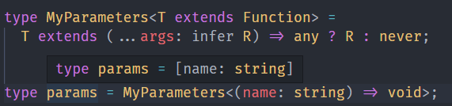

在这里我们编写了类型参数为`T`，通过`extends`约束为函数，并使用`infer`提取他的内部参数。

## ReturnType

`ReturnType` 用于提取函数参数的返回值。

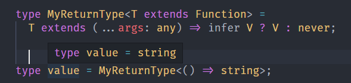

这里的思路和上方一样。
在这里我们编写了类型参数为`T`，通过`extends`约束为函数，并使用`infer`提取他的返回值。

## ConstructorParameters

`ConstructorParameters`中指的是构造函数（与普通函数的区别是能被`new`）.用于提取构造函数的参数。

```ts
type MyConstructorParameters<
  T extends new (...args: any) => any
> = T extends new (...args: infer R) => any ? R : never;
```

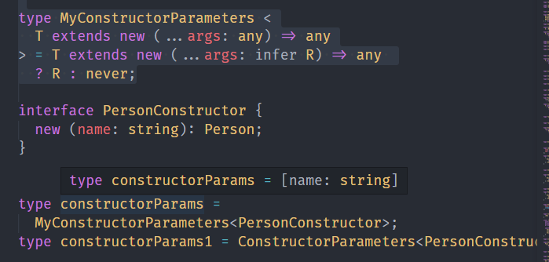

## InstanceType

下面我们提取构造器类返回值的类型

```ts
type MyInstanceType<T extends new (...args: any) => any> = T extends new (
  ...args: any
) => infer R
  ? R
  : never;

type instanceType = MyInstanceType<PersonConstructor>;
```

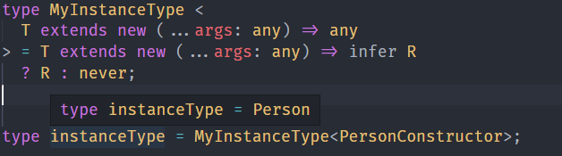

## ThisParameterType

函数里可以调用 this，这个 this 的类型也可以约束：

同样，this 的类型也可以提取出来，通过 ThisParameterType 这个内置的高级类型

```ts
type MyThisParameterType<T> = T extends (this: infer U, ...args: any[]) => any
  ? U
  : unknown;
```

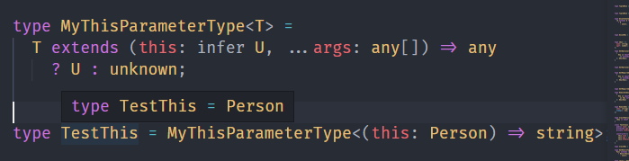

## OmitThisParameter

我们可以将函数的`this`提取出去，构造一个新的，比如删除`this`的类型`OmitThisParameter`

```ts
type MyOmitThisParameter<T> = T extends (this: any, ...args: infer R) => infer V
  ? (...args: R) => V
  : T;
```

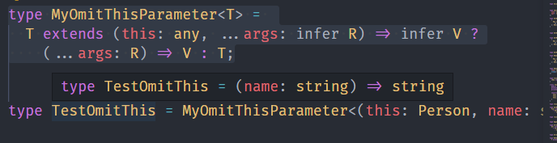

## Partial

索引类型可以通过映射类型的语法做修改，比如可选。

```ts
type Partial<T> = {
  [P in keyof T]?: P[T];
};
```

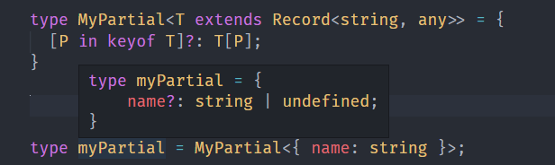

## Required

把索引改成可选的，也就是 Required 类型

```ts
type MyRequire<T extends Record<string, any>> = {
  [P in keyof T]-?: T[P];
};
```

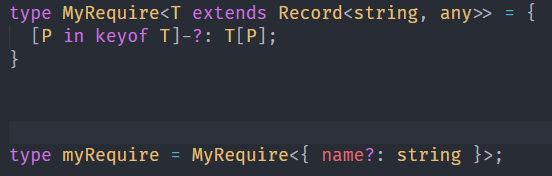

## ReadOnly

将索引变成只读的

```ts
type Readonly<T> = {
  readonly [P in keyof T]: T[P];
};
```

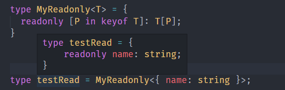

## Pick

映射类型的语法用于构造新的索引类型，在构造的过程中可以对索引和值做一些修改或过滤。

比如可以用 Pick 实现过滤：

```ts
type Pick<T extends Record<string, any>, K extends keyof T> = {
  [P in K]: T[P];
};
```

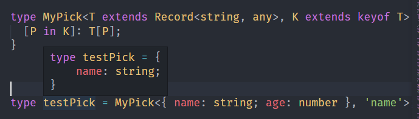

## Record

Record 用于创建索引类型，传入 key 和值的类型：

```ts
type Record<K, V> = {
  [P in K]: V;
};
```

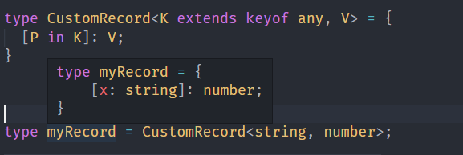

## Exclude

当想从一个联合类型中去掉一部分类型时，可以用 Exclude 类型：

```typescript
type Exclude<T, U> = T extends U ? never : T;
```

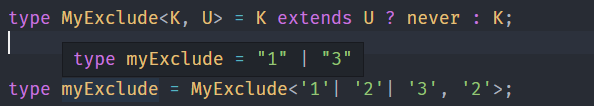

## Extract

可以过滤掉，自然也可以保留，Exclude 反过来就是 Extract：

```ts
type Extract<T, U> = T extends U ? T : never;
```

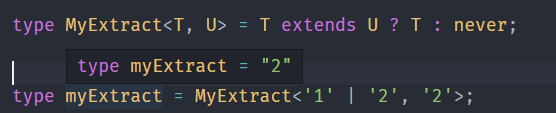

## Omit

我们知道了 Pick 可以取出索引类型的一部分索引构造成新的索引类型，那反过来就是去掉这部分索引构造成新的索引类型。

可以结合 Exclude 来轻松实现：

```ts
type MyOmit<T, K extends keyof T> = Pick<T, Exclude<keyof T, K>>;
```

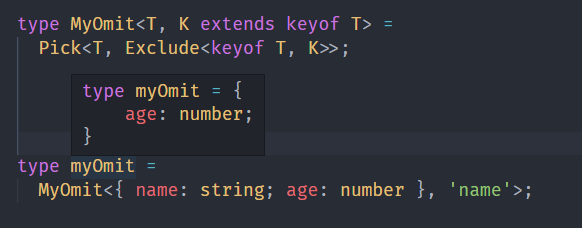

## Awaited

在递归那节我们写过取 Promise 的 ValuType 的高级类型，这个比较常用，ts 也给内置了，就是 Awaited。

它的实现比我们当时写的完善一些：

```typescript
type Awaited<T> = T extends null | undefined
  ? T
  : T extends object & { then(onfulfilled: infer F): any }
  ? F extends (value: infer V, ...args: any) => any
    ? Awaited<V>
    : never
  : T;
```

## NonNullable

NonNullable 就是用于判断是否为非空类型，也就是不是 null 或者 undefined 的类型的，实现比较简单：

```typescript
type NonNullable<T> = T extends null | undefined ? never : T;
```

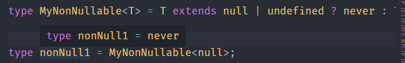

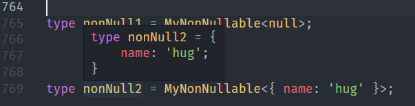

## Uppercase、Lowercase、Capitalize、Uncapitalize

这四个类型是分别实现大写、小写、首字母大写、去掉首字母大写的。

## 总结

很多类型其实 TS 已经内置了，我们可以去结合这些类型进行编程，得到我们自己的类型，用于我们的编程开发中。

## 参考

- [TypeScript 类型体操通关秘籍 - zxg\_神说要有光 - 掘金课程 (juejin.cn)](https://juejin.cn/book/7047524421182947366/section/7048281553822023712)
